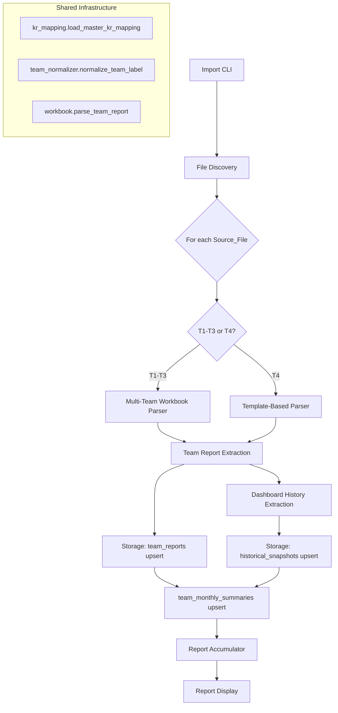

# Design Document: Historical Data Import

## Overview

This feature imports historical OKR data from 4 monthly workbooks (T1–T4, January–April 2026) located in `KHMT_T1_T2_T3_T4/` into the **existing** database tables: `team_reports`, `historical_snapshots`, and `team_monthly_summaries`. It reuses the project's established parsing infrastructure (`workbook.py`, `team_normalizer.py`, `kr_mapping.py`) rather than creating new models.

### Key Design Decisions

1. **Use existing tables** — No new SQLAlchemy models. Data flows into `TeamReportModel`, `HistoricalSnapshotModel`, and `TeamMonthlySummaryModel`.
2. **T1–T3 vs T4 strategy** — T1–T3 are read from the original multi-team workbook format. T4 team reports prioritize per-team templates from `template_xlsx/` (TBĐL.xlsx, TBCH.xlsx, TBHTĐK.xlsx, TCĐK.xlsx) since they contain the latest approved structure.
3. **Dynamic header detection** — Dashboard history parsing detects the "Đội/Tổ" header row dynamically rather than hard-coding row 22.
4. **Canonical KR mapping** — Uses `template_xlsx/OKR_Workshop.xlsx` (sheet "OKR X.ĐK 2026") as the authoritative KR mapping source. Falls back to the workbook T4 if the Workshop file is unavailable. Never uses the fallback mapping when the config file doesn't exist.
5. **Team aliases** — Extends `TEAM_LABEL_ALIASES` with: `HTĐK` → `TBHTĐK`, `TBĐ` → `TBĐL`, `TCDK` → `TCĐK`.
6. **Idempotent upsert** — Re-running the import for the same month/team overwrites existing records.
7. **CLI-based execution** — A standalone Python script, not an API endpoint.

## Architecture



### Component Responsibilities

| Component | Responsibility |
|-----------|---------------|
| **Import CLI** | Entry point, orchestrates pipeline per file |
| **File Discovery** | Locates 4 xlsx files, extracts month from filename pattern |
| **Multi-Team Workbook Parser** | For T1–T3: parses the workbook that contains all 4 teams in one file |
| **Template-Based Parser** | For T4: reads per-team templates from `template_xlsx/` |
| **Dashboard History Extractor** | Dynamically finds team rows by header detection, extracts monthly assessments |
| **Storage Layer** | Upserts into `team_reports`, `historical_snapshots`, `team_monthly_summaries` |
| **Report Accumulator** | Collects metrics, errors, and warnings |

## Components and Interfaces

### 1. File Discovery (`app/services/okr/historical_import.py`)

```python
@dataclass
class DiscoveredFile:
    path: Path
    month: int
    year: int
    file_name: str

def discover_source_files(directory: Path) -> list[DiscoveredFile]:
    """Locate xlsx files matching 'OKR tháng XX-YYYY - X.ĐK.xlsx' pattern."""
    ...

def extract_month_year_from_filename(filename: str) -> tuple[int, int]:
    """Parse 'OKR tháng 01-2026 - X.ĐK.xlsx' → (1, 2026)."""
    pattern = r"OKR tháng (\d{2})-(\d{4})"
    ...
```

### 2. Month-Column Group Selection

Each workbook contains KR assessment data in grouped columns per month. The parser must select the correct column group for the target month:

```python
# Column groups for monthly report data (Tình hình thực hiện, Đánh giá, Ghi chú)
MONTH_COLUMN_GROUPS: dict[int, tuple[int, int, int]] = {
    1: (16, 17, 18),   # P:Q:R
    2: (19, 20, 21),   # S:T:U
    3: (22, 23, 24),   # V:W:X
    4: (26, 27, 28),   # Z:AA:AB
    # ... extends for additional months
}

def get_report_columns_for_month(month: int) -> tuple[int, int, int]:
    """Return (report_col, assessment_col, notes_col) for the given month."""
    ...
```

### 3. Multi-Team Workbook Parser (T1–T3)

For months 1–3, each workbook contains data for all 4 teams. The parser iterates through sheets or sections to extract per-team data:

```python
def parse_multi_team_workbook(
    file_path: Path,
    month: int,
    year: int,
    kr_mapping: dict[str, KRMapping],
) -> list[dict[str, Any]]:
    """
    Parse a T1-T3 workbook that contains all teams.
    Returns a list of team report dicts compatible with TeamReportModel.
    Uses the existing workbook.parse_team_report() for each team sheet.
    """
    ...
```

### 4. Template-Based Parser (T4)

For month 4, per-team templates from `template_xlsx/` are preferred:

```python
TEMPLATE_FILES: dict[str, str] = {
    "TBHTĐK": "template_xlsx/TBHTĐK.xlsx",
    "TBCH": "template_xlsx/TBCH.xlsx",
    "TBĐL": "template_xlsx/TBĐL.xlsx",
    "TCĐK": "template_xlsx/TCĐK.xlsx",
}

def parse_template_report(
    template_path: Path,
    team: str,
    month: int,
    year: int,
    kr_mapping: dict[str, KRMapping],
) -> dict[str, Any]:
    """
    Parse a per-team template xlsx for T4.
    Falls back to the main workbook if template is missing.
    """
    ...
```

### 5. Dynamic Dashboard History Detection

Instead of hard-coding row 22 for team labels, the parser scans for the header row containing "Đội/Tổ" or team identifiers:

```python
def find_dashboard_team_rows(sheet) -> list[tuple[int, str]]:
    """
    Scan Dashboard sheet to find rows containing team labels.
    Returns list of (row_number, normalized_team_code).
    Detects by looking for known team names/aliases in column A.
    """
    for row in range(1, sheet.max_row + 1):
        label = str(sheet.cell(row, 1).value or "").strip()
        team, _ = normalize_team_label(label)
        if team:
            yield (row, team)
```

### 6. Extended Team Aliases

Added to `team_normalizer.py`:

```python
# New aliases to add
ADDITIONAL_ALIASES = {
    "htđk": "TBHTĐK",
    "htdk": "TBHTĐK",
    "tbđ": "TBĐL",
    "tbd": "TBĐL",
    "tcdk": "TCĐK",
}
```

### 7. Discipline Overrides (T4)

For T4, TBĐL and TBCH have specific discipline overrides that must be applied:

```python
T4_DISCIPLINE_OVERRIDES: dict[str, dict[str, str]] = {
    "TBĐL": {"discipline_status": "NOK", "discipline_description": "..."},
    "TBCH": {"discipline_status": "NOK", "discipline_description": "..."},
}

def apply_discipline_overrides(
    team_level: dict[str, Any],
    team: str,
    month: int,
) -> dict[str, Any]:
    """Apply month-specific discipline overrides."""
    if month == 4 and team in T4_DISCIPLINE_OVERRIDES:
        team_level.update(T4_DISCIPLINE_OVERRIDES[team])
    return team_level
```

### 8. Storage Layer

```python
def upsert_team_report(
    db: Session,
    team: str,
    month: int,
    year: int,
    parsed_data: dict[str, Any],
    source_file: str,
) -> TeamReportModel:
    """
    Upsert a team report. If a report exists for (team, month, year),
    overwrite it. Otherwise create new.
    """
    ...

def upsert_team_monthly_summary(
    db: Session,
    team: str,
    month: int,
    year: int,
    team_level: dict[str, Any],
) -> TeamMonthlySummaryModel:
    """
    Upsert team_monthly_summaries with discipline status and monthly assessment.
    Uses UniqueConstraint(team, month, year).
    """
    ...

def upsert_historical_snapshots(
    db: Session,
    workbook_bytes: bytes,
    source_file_name: str,
    imported_by: str,
) -> dict[str, Any]:
    """
    Delegates to existing import_historical_snapshot() for Dashboard/data blocks.
    """
    ...
```

### 9. KR Mapping Resolution

```python
def resolve_kr_mapping() -> dict[str, KRMapping]:
    """
    Load canonical KR mapping. Priority:
    1. template_xlsx/OKR_Workshop.xlsx (sheet "OKR X.ĐK 2026")
    2. Workbook T4 (if Workshop file unavailable)
    Never falls back to the generated fallback mapping.
    Raises FileNotFoundError if neither source exists.
    """
    workshop_path = settings.workspace_dir / "template_xlsx" / "OKR_Workshop.xlsx"
    if workshop_path.exists():
        return mapping_by_code(workshop_path)
    # Try T4 workbook as secondary source
    t4_path = settings.workspace_dir / "KHMT_T1_T2_T3_T4" / "OKR tháng 04-2026 - X.ĐK.xlsx"
    if t4_path.exists():
        return mapping_by_code(t4_path)
    raise FileNotFoundError("No canonical KR mapping source found")
```

### 10. Import Session Orchestrator

```python
@dataclass
class FileImportResult:
    file_name: str
    month: int
    teams_imported: list[str]
    records_per_team: dict[str, int]
    rows_skipped: int
    success: bool
    errors: list[ImportError]
    warnings: list[dict[str, Any]]

@dataclass
class ImportSessionReport:
    file_results: list[FileImportResult]
    total_team_reports: int
    total_snapshots: int
    total_summaries_upserted: int
    total_files_attempted: int
    total_files_successful: int
    errors: list[ImportError]

def run_historical_import(
    source_directory: Path,
    imported_by: str = "historical_import",
) -> ImportSessionReport:
    """
    Main orchestrator:
    1. Discover files
    2. Resolve KR mapping
    3. For each file:
       - If T1-T3: parse multi-team workbook
       - If T4: parse per-team templates (fallback to workbook)
       - Extract dashboard history
       - Upsert team_reports
       - Upsert historical_snapshots
       - Upsert team_monthly_summaries
    4. Return report
    """
    ...
```

## Data Models

### Existing Tables Used (No New Models)

**`team_reports`** — Stores per-team KR assessments:
- `team`, `report_month`, `report_year` identify the record
- `assessments` (JSON): list of KR assessment dicts
- `team_level` (JSON): discipline status, monthly assessment
- `source_type`: set to `"historical_import"` to distinguish from uploads
- `file_name`, `file_path`: source traceability

**`historical_snapshots`** — Stores Dashboard history and data blocks:
- Keyed by `(source_file_hash, team, month, year, source_range)`
- `monthly_assessment`: the team's monthly assessment from Dashboard
- `chart_payload`: raw data block content

**`team_monthly_summaries`** — Stores aggregated monthly team status:
- Keyed by `(team, month, year)` via `UniqueConstraint`
- `discipline_status`, `monthly_assessment`
- `stats` (JSON): additional metrics

### Duplicate Detection

| Table | Duplicate Key | Behavior |
|-------|--------------|----------|
| `team_reports` | `(team, report_month, report_year)` + `is_current_version=True` | Overwrite existing |
| `historical_snapshots` | `(source_file_hash, team, month, year, source_range)` | Skip if exists (existing behavior) |
| `team_monthly_summaries` | `(team, month, year)` | Upsert (update if exists) |

## Correctness Properties

*A property is a characteristic or behavior that should hold true across all valid executions of a system — essentially, a formal statement about what the system should do. Properties serve as the bridge between human-readable specifications and machine-verifiable correctness guarantees.*

### Property 1: Month Extraction from Filename

*For any* filename matching the pattern `OKR tháng XX-YYYY - X.ĐK.xlsx` where XX is a valid month (01–12) and YYYY is a valid year, `extract_month_year_from_filename` SHALL return the correct `(month, year)` tuple.

**Validates: Requirements 2.2**

### Property 2: Team Label Normalization Round-Trip

*For any* string that is a known team alias (including the new aliases HTĐK, TBĐ, TCDK), `normalize_team_label` SHALL return the canonical team code from `TEAMS = ("TBHTĐK", "TBCH", "TBĐL", "TCĐK")`.

**Validates: Requirements 2.5**

### Property 3: Empty Row Skipping

*For any* worksheet row where both the objective/KR code column and the KR name column contain only whitespace or are empty, the parser SHALL skip that row and not include it in the extracted assessments list.

**Validates: Requirements 2.4**

### Property 4: KR Assessment Field Extraction

*For any* valid KR row in a worksheet (containing a recognizable KR code), the parser SHALL extract `implementation_report`, `team_self_assessment`, and `notes` from the correct month column group, and the extracted values SHALL match the original cell values character-for-character (preserving Vietnamese diacritics).

**Validates: Requirements 2.1, 2.5, 5.1**

### Property 5: Storage Round-Trip for Team Reports

*For any* parsed team report dict containing `team`, `report_month`, `report_year`, and `assessments`, after upserting to `team_reports` and retrieving the record, the stored `assessments` JSON SHALL contain the same KR codes and assessment values as the input.

**Validates: Requirements 3.2, 3.3, 5.1**

### Property 6: Import Idempotence

*For any* set of source files, running the import twice SHALL result in the same database state as running it once — specifically, the count of `team_reports` records for a given `(team, month, year)` SHALL remain 1, and the `team_monthly_summaries` record SHALL reflect the latest import values.

**Validates: Requirements 3.4**

### Property 7: Report Count Accuracy

*For any* import session processing N files where each file yields team reports for T teams with K_i KR assessments per team, the `ImportSessionReport` SHALL report `total_team_reports` equal to the sum of successfully stored team reports, and each `FileImportResult.records_per_team[team]` SHALL equal the actual count of KR assessments extracted for that team.

**Validates: Requirements 3.6, 4.1, 4.2**

### Property 8: Hierarchical Objective-KR Preservation

*For any* worksheet containing objective rows followed by KR rows, the parser SHALL associate each extracted KR assessment with the correct `workshop_kr_code` as determined by the canonical KR mapping, and no KR SHALL be orphaned or assigned to the wrong objective.

**Validates: Requirements 2.3**

### Property 9: Numeric Precision Preservation

*For any* numeric cell value in a source worksheet (target values, metric ratios), the parser SHALL preserve the value to its full decimal precision as stored in the xlsx file, without rounding or truncation.

**Validates: Requirements 5.2**

### Property 10: Dynamic Dashboard Team Detection

*For any* Dashboard sheet containing team labels in column A (using any known alias or canonical name), `find_dashboard_team_rows` SHALL correctly identify all team rows regardless of their absolute row position, and the returned team codes SHALL all be members of `TEAMS`.

**Validates: Requirements 1.2**

## Error Handling

### Error Categories

| Error Type | Trigger | Behavior |
|-----------|---------|----------|
| File Not Found | Source file missing | Log filename, continue to next file |
| File Corrupted | Cannot open xlsx | Log filename + error, continue |
| Read Timeout | File read exceeds 30s | Log timeout, continue |
| KR Mapping Missing | No Workshop or T4 file | Raise error, abort import |
| Team Not Identified | Sheet/label not recognized | Log warning, skip team |
| Parse Error | Unexpected row structure | Log file + row + detail, skip row |
| Storage Failure | DB write fails | Log record + reason, continue |

### Error Propagation

- Errors are **collected, not raised** (except KR mapping failure which is fatal).
- Each file processes independently; failure in one file does not affect others.
- Within a file, failure for one team does not affect other teams.
- All errors aggregate into `ImportSessionReport`.

### Timeout Implementation (Windows-compatible)

```python
import threading
from pathlib import Path

def read_workbook_with_timeout(file_path: Path, timeout: int = 30):
    result = [None]
    error = [None]

    def _read():
        try:
            result[0] = load_workbook(file_path, read_only=True, data_only=True)
        except Exception as e:
            error[0] = e

    thread = threading.Thread(target=_read)
    thread.start()
    thread.join(timeout=timeout)

    if thread.is_alive():
        raise TimeoutError(f"Reading {file_path.name} exceeded {timeout}s")
    if error[0]:
        raise error[0]
    return result[0]
```

## Testing Strategy

### Property-Based Testing (Hypothesis)

The project already uses `hypothesis>=6.112.0`. Property tests go in `backend/tests/property/`.

**Configuration:**
- Minimum 100 iterations per property test (`@settings(max_examples=100)`)
- Each test tagged: `# Feature: historical-data-import, Property {N}: {title}`

**Property tests to implement:**

| # | Property | Generator Strategy |
|---|----------|-------------------|
| 1 | Month extraction from filename | Generate random valid month (01-12) and year (2020-2035) |
| 2 | Team label normalization | Generate from known alias set + random case/whitespace variations |
| 3 | Empty row skipping | Generate worksheets with interspersed whitespace-only rows |
| 4 | KR field extraction | Generate random Vietnamese text + numbers, write to mock worksheet |
| 5 | Storage round-trip | Generate random assessment dicts, upsert and retrieve |
| 6 | Import idempotence | Generate random reports, import twice, compare DB state |
| 7 | Report count accuracy | Generate import scenarios with known counts |
| 8 | Hierarchical KR preservation | Generate worksheets with objective/KR structure |
| 9 | Numeric precision | Generate random floats with varying decimal places |
| 10 | Dynamic dashboard detection | Generate sheets with team labels at random row positions |

### Unit Tests (pytest)

- File not found handling (Req 1.3)
- Corrupted file handling (Req 1.4)
- Timeout handling (Req 1.5)
- T4 discipline overrides for TBĐL and TBCH
- Template fallback when `template_xlsx/` file missing
- Error summary format (Req 4.3)
- Success confirmation message (Req 4.4)
- Round-trip mismatch reporting (Req 5.4)
- Empty cells map to None (Req 5.5)
- Objective with no KR rows (Req 2.6)

### Integration Tests

- End-to-end import with actual T1–T4 xlsx files
- Verify `team_reports`, `historical_snapshots`, `team_monthly_summaries` populated correctly
- Verify dashboard history extraction with dynamic row detection
- Verify KR mapping loaded from `OKR_Workshop.xlsx`
- Full pipeline with mixed success/failure scenarios

### Test File Organization

```
backend/tests/
├── property/
│   └── test_historical_import_properties.py
├── unit/
│   └── test_historical_import.py
└── integration/
    └── test_historical_import_e2e.py
```
