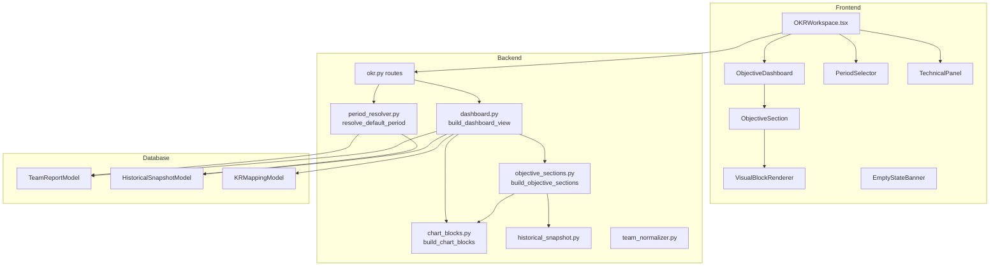
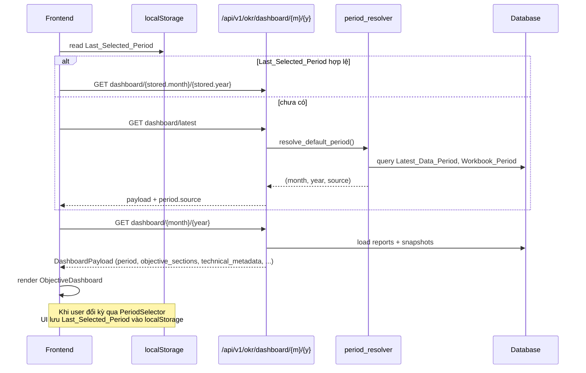
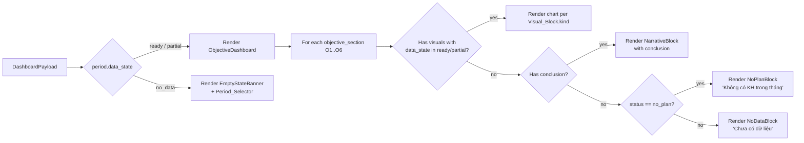
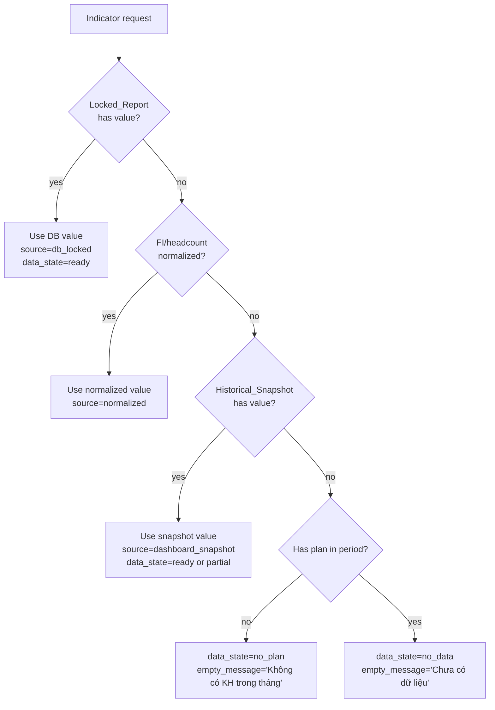

# Design Document: Objective-First Dashboard

## Overview

Tính năng `Objective-First Dashboard` tái cấu trúc dashboard OKR web từ mô hình "data-block-first" (render các `chart_blocks` rời rạc như STOP, đào tạo, ET/KNL, VHDN) sang mô hình "objective-first" bám theo workbook Excel gốc. Dashboard mới được tổ chức theo 6 mục tiêu chiến lược `O1 → O6`, mỗi mục tiêu là một băng nội dung độc lập gồm tiêu đề, trạng thái, kết luận, các biểu đồ/thẻ KPI và ghi chú liên quan.

Thiết kế giải quyết hai nhóm vấn đề đã nêu trong `docs/findings-okr-dashboard-current-issues.md`:

1. **Luồng dữ liệu/kỳ báo cáo chưa đúng** — frontend đang mặc định mở kỳ hiện tại (T5/2026) thay vì kỳ mới nhất có dữ liệu (T4/2026). Thiết kế mới đưa ra thứ tự ưu tiên chọn kỳ (`Last_Selected_Period → Latest_Data_Period → Workbook_Period → kỳ hiện tại`) và thông báo tiếng Việt khi kỳ đang xem không có dữ liệu.
2. **Dashboard chưa bám nghiệp vụ** — `chart_blocks` rời rạc, `Tất cả KR` trùng với `Ma trận đánh giá`, token kỹ thuật (`EMPTY_CHART_DATA`, `data!A3:E18`) lộ ra UI nghiệp vụ. Thiết kế mới bổ sung payload `objective_sections` tổ chức theo `O1 → O6`, gom metadata kỹ thuật vào `Technical_Panel` ẩn mặc định, và Việt hóa chuỗi UI.

### Phạm vi

- **Backend**: thêm service `build_objective_sections(...)` và tích hợp vào `build_dashboard_view(...)`; bổ sung trường `period`, `objective_sections`, `technical_metadata` vào payload; giữ nguyên schema các trường cũ (`columns`, `teams`, `leader_kpi_allocations`, `kpi_allocation_summary`, `monthly_history`, `chart_blocks`, `warnings`).
- **Frontend**: thêm component `ObjectiveDashboard` render theo `objective_sections`, `TechnicalPanel` thu gọn theo vai trò, logic chọn kỳ mặc định có ưu tiên `Last_Selected_Period` lưu ở `localStorage`, và thông báo Việt hóa.
- **Ngoài phạm vi**: sửa launcher `start-dev.cmd -ResetData` (tách thành spec riêng), thay đổi schema DB hoặc logic FI/ET nguồn.

### Mục tiêu thiết kế

- Dashboard web đọc giống báo cáo quản trị từ `O1` đến `O6`, không còn là danh sách card debug.
- "Có gì vẽ nấy, không có thì kết luận" — không render khung chart trắng, không render số liệu placeholder.
- Tương thích ngược: client cũ đang đọc `chart_blocks` vẫn chạy; payload mới chỉ bổ sung trường.
- Dữ liệu locked DB luôn thắng snapshot; snapshot chỉ bổ sung phần thiếu.
- Không rò rỉ token kỹ thuật (`EMPTY_CHART_DATA`, `UNCONFIRMED_EXCEL_BLOCKS`, `data!A3:E18`) vào UI nghiệp vụ.

## Architecture

### High-Level Architecture



### Period Resolution Flow



### Render Flow Inside Dashboard



### Data Priority Pipeline



### Key Design Decisions

| Decision | Rationale |
| --- | --- |
| Thêm payload `objective_sections` thay vì thay `chart_blocks` | Giữ tương thích ngược với client cũ. Client mới đọc `objective_sections`; client cũ đọc `chart_blocks`. |
| `objective_sections` luôn trả 6 phần tử cố định `O1..O6` | Giữ thứ tự và cấu trúc ổn định cho frontend, ngay cả khi một objective không có dữ liệu (vẫn có section với `status=no_data`). |
| Period resolver là service backend, không nhúng vào frontend | Backend đã có DB và snapshot. Frontend chỉ biết `Last_Selected_Period` (localStorage). Kết hợp tại endpoint `GET /okr/dashboard/latest`. |
| `Technical_Panel` ẩn mặc định, phân quyền theo vai trò | `Business_User` không có nút mở; `Admin_User`/`Mixed_Role_User` có toggle. Đây là yêu cầu R3. |
| Chart render bằng CSS/SVG inline, không thêm thư viện chart nặng | Phù hợp requirement 11.4 và hiện trạng stack frontend (chưa có Recharts). |
| Không xóa `chart_blocks`, `minor_okr_summary`, `source_references` khỏi payload | Tuân thủ R14 (tương thích ngược) và R8.5 (KR data vẫn còn cho `Evaluation_Matrix` và drill-down). |
| `Tất cả KR` ẩn khỏi dashboard chính, nhưng KRDrillDownPanel giữ nguyên | R8: không hiển thị `KR_List_Section` như section chính; R8.2/R8.4: drill-down vẫn hoạt động. |

## Components and Interfaces

### Backend Components

#### 1. `app/services/okr/period_resolver.py` (mới)

**Trách nhiệm**: resolve kỳ báo cáo mặc định theo R1.

```python
from dataclasses import dataclass
from typing import Literal, Optional

PeriodSource = Literal["last_selected", "latest_data", "workbook", "current"]

@dataclass(frozen=True)
class ResolvedPeriod:
    month: int
    year: int
    source: PeriodSource
    label: str  # "T4/2026"

def resolve_default_period(
    *,
    last_selected: Optional[tuple[int, int]],
    latest_data: Optional[tuple[int, int]],
    workbook: Optional[tuple[int, int]],
    today: tuple[int, int],
) -> ResolvedPeriod: ...

def find_latest_data_period(db) -> Optional[tuple[int, int]]: ...

def find_workbook_period(db) -> Optional[tuple[int, int]]: ...
```

**Thuật toán**:

1. Nếu `last_selected` hợp lệ → dùng với `source="last_selected"`.
2. Else nếu `latest_data` có giá trị → dùng với `source="latest_data"`.
3. Else nếu `workbook` có giá trị → dùng với `source="workbook"`.
4. Else dùng `today` với `source="current"` (cho phép mở dashboard kể cả khi rỗng — R1.5).

**Chú ý**: `last_selected` chỉ đến từ frontend (qua query param hoặc header); backend không lưu trạng thái này ở server.

#### 2. `app/services/okr/objective_sections.py` (mới)

**Trách nhiệm**: nhóm dữ liệu thành 6 `ObjectiveSection` theo mapping O1–O6 trong R7.

```python
from typing import Literal, TypedDict, Optional

ObjectiveCode = Literal["O1", "O2", "O3", "O4", "O5", "O6"]
ObjectiveStatus = Literal["completed", "at_risk", "failed", "no_plan", "no_data"]
DataState = Literal["ready", "partial", "no_plan", "no_data"]
VisualKind = Literal[
    "status_grid",
    "bar_line_chart",
    "bar_chart",
    "line_chart",
    "training_bar_chart",
    "radar_chart",
    "narrative_card",
    "progress_card",
    "kpi_badges",
]

class VisualBlock(TypedDict):
    id: str
    kind: VisualKind
    title: str
    data_state: DataState
    empty_message: Optional[str]
    source: str  # "db_locked" | "dashboard_snapshot" | "normalized" | "fi_module"
    payload: dict  # chart-specific, tương thích chart_blocks

class ObjectiveSection(TypedDict):
    objective_code: ObjectiveCode
    title: str
    status: ObjectiveStatus
    conclusion: Optional[str]
    visuals: list[VisualBlock]
    notes: list[str]
    source_references: list[str]

def build_objective_sections(
    *,
    month: int,
    year: int,
    team_reports: list[dict],
    historical_snapshots: list[dict],
    headcounts: dict,
    fi_counts_by_team: dict,
    chart_blocks: dict,  # đã tính sẵn bởi build_chart_blocks
) -> list[ObjectiveSection]: ...
```

**Mapping O1–O6 (tham chiếu R7)**:

| Objective | Title (VI) | Visuals mặc định |
| --- | --- | --- |
| `O1` | "Không có sự cố gây dừng máy, mất sản lượng, lỗi chủ quan" | `status_grid` (tình trạng sự cố), narrative cards cho ghi chú vi phạm |
| `O2` | "Đảm bảo tính ổn định thiết bị điều khiển" | `bar_line_chart` (BDĐK theo tháng), `kpi_badges` (target/result/lũy kế) |
| `O3` | "Không có tai nạn và sự cố an toàn, sức khỏe, môi trường" | `bar_chart` STOP theo đội (nguồn `chart_blocks["stop_by_team"]`), `line_chart` STOP theo tháng (nguồn `chart_blocks["stop_by_month"]`) |
| `O4` | "Triển khai các hạng mục cải tiến thuộc chuyên môn" | `narrative_card` tiến độ từng KR |
| `O5` | "Triển khai các trụ cột TPM thuộc chuyên môn" | `training_bar_chart` (đào tạo), `radar_chart` (khung năng lực), `kpi_badges` (sáng kiến), `narrative_card` FI (tách riêng khỏi sáng kiến — R7.5), `narrative_card` AM/PM/CTKT |
| `O6` | "Văn hóa doanh nghiệp" | `progress_card` chạy bộ, `bar_chart` hội thao, `narrative_card` chia sẻ văn hóa |

**Quy tắc `data_state` / `status`**:

- `data_state` ở mức từng `Visual_Block`; `status` ở mức `ObjectiveSection`.
- `status = completed` khi tất cả KR của objective có `dashboard_status` ∈ {`OK`, `GOOD`} và có kế hoạch.
- `status = at_risk` khi ít nhất một KR `NG` nhưng có KR hoàn thành.
- `status = failed` khi tất cả KR của objective không đạt.
- `status = no_plan` khi không có KR nào có kế hoạch trong kỳ.
- `status = no_data` khi không có dữ liệu DB/snapshot cho objective.

**Ưu tiên nguồn** (R10):

1. `Locked_Report` (DB).
2. FI/headcount đã chuẩn hóa (cho O5.KR13 FI, headcount cho O3/O6).
3. `Historical_Snapshot` (workbook). Nếu dùng snapshot, `source="dashboard_snapshot"`.
4. Fallback `no_plan` (có `master_target` nhưng không có kế hoạch) hoặc `no_data` (không có bất kỳ dấu vết nào).

#### 3. `app/services/okr/dashboard.py` (chỉnh sửa)

**Thay đổi trong `build_dashboard_view(...)`**:

- Sau khi build `chart_blocks` như hiện tại, gọi `build_objective_sections(...)` và gán vào key `objective_sections`.
- Thêm key `period = {"month": m, "year": y, "label": f"T{m}/{y}", "data_state": "ready|partial|no_data"}`.
  - `data_state = "ready"` nếu có ít nhất 1 `Locked_Report` hoặc snapshot trong kỳ.
  - `data_state = "partial"` nếu có `Locked_Report` ở một phần KR và `Historical_Snapshot` ở phần còn lại.
  - `data_state = "no_data"` nếu không có bất kỳ dữ liệu kỳ nào.
- Tách warnings thành `technical_metadata = {"warnings": [...], "source_references": {...}, "latest_data_period": (m, y) | None}`.
- Giữ nguyên `warnings` ở cấp root cho tương thích ngược.
- Giữ nguyên `chart_blocks`, `minor_okr_summary`, `source_references`, `monthly_history`, `columns`, `teams`, `leader_kpi_allocations`, `kpi_allocation_summary`.
- Bọc `build_objective_sections(...)` bằng try/except — nếu lỗi → `objective_sections = []` và thêm warning `OBJECTIVE_SECTIONS_BUILD_FAILED` vào `technical_metadata.warnings` (R14.4).

**Chữ ký giữ nguyên**:

```python
def build_dashboard_view(
    month: int,
    year: int,
    team_reports: list[dict[str, Any]],
    master: list[Any] | None = None,
    *,
    history_reports: list[dict[str, Any]] | None = None,
    matrix_history_reports: list[dict[str, Any]] | None = None,
    historical_snapshots: list[dict[str, Any]] | None = None,
    headcounts: dict[str, dict[str, Any]] | None = None,
    fi_counts_by_team: dict[str, int] | None = None,
    principal: dict[str, str] | None = None,
) -> dict[str, Any]: ...
```

#### 4. `app/api/routes/okr.py` (chỉnh sửa)

**Route mới**: `GET /okr/dashboard/latest` — trả về kỳ mặc định đã resolve + payload dashboard tương ứng.

```python
@router.get("/dashboard/latest")
def dashboard_latest(
    last_selected_month: int | None = None,
    last_selected_year: int | None = None,
    principal: dict = Depends(require_role(*REFERENCE_VIEW_ROLES)),
    db: Session = Depends(get_db),
):
    resolved = resolve_default_period(
        last_selected=(last_selected_month, last_selected_year) if last_selected_month and last_selected_year else None,
        latest_data=find_latest_data_period(db),
        workbook=find_workbook_period(db),
        today=(datetime.utcnow().month, datetime.utcnow().year),
    )
    payload = dashboard(resolved.month, resolved.year, principal=principal, db=db)
    payload["period"]["source"] = resolved.source
    return payload
```

**Route `GET /okr/dashboard/{month}/{year}`**: giữ nguyên, bổ sung các field mới ở payload.

### Frontend Components

#### 1. `frontend/src/features/okr/components/ObjectiveDashboard.tsx` (mới)

**Trách nhiệm**: render 6 `ObjectiveSection` theo thứ tự `O1..O6` (R5).

```tsx
export interface ObjectiveDashboardProps {
  sections: ObjectiveSection[];
  onDrillDown?: (objectiveCode: string) => void;
}

export function ObjectiveDashboard(props: ObjectiveDashboardProps): JSX.Element;
```

**Quy tắc render** (R5, R6):

- Duyệt `sections` theo thứ tự backend trả về (không sort lại).
- Mỗi section gọi `<ObjectiveSection ... />`.
- Không render `chart_blocks` như section chính (R5.4).

#### 2. `frontend/src/features/okr/components/ObjectiveSection.tsx` (mới)

```tsx
export interface ObjectiveSectionProps {
  section: ObjectiveSection;
  onDrillDown?: (objectiveCode: string) => void;
}
```

**Render**:

- Header: `[O1] Không có sự cố...` + `<ObjectiveStatusBadge status={section.status} />`.
- Body:
  - Nếu có `section.conclusion` → render NarrativeBlock.
  - Duyệt `section.visuals`, mỗi visual dispatch sang `VisualBlockRenderer` theo `kind`.
- Nếu `visuals` rỗng và không có `conclusion` và `status=no_plan` → hiện `NoPlanBlock("Không có KH trong tháng")` (R6.5).
- Nếu `visuals` rỗng và không có `conclusion` và `status=no_data` → hiện `NoDataBlock("Chưa có dữ liệu")` (R6.6).
- Field thiếu → để trống, không bỏ qua section (R5.3).

#### 3. `frontend/src/features/okr/components/VisualBlockRenderer.tsx` (mới)

Dispatch theo `kind`:

| `kind` | Component | Khi `data_state = no_plan/no_data` |
| --- | --- | --- |
| `status_grid` | `<StatusGrid />` | Hiện `<NoPlanBlock />` / `<NoDataBlock />` |
| `bar_chart` | `<BarChartInline />` | như trên |
| `line_chart` | `<LineChartInline />` | như trên |
| `bar_line_chart` | `<BarLineChartInline />` | như trên |
| `training_bar_chart` | `<TrainingBarChart />` | như trên |
| `radar_chart` | `<RadarChartInline />` | như trên |
| `narrative_card` | `<NarrativeCard />` | như trên |
| `progress_card` | `<ProgressCard />` | như trên |
| `kpi_badges` | `<KpiBadges />` | như trên |

Renderer dùng SVG/CSS inline, không phụ thuộc thư viện chart (R11.4). Reuse code từ `ChartBlocks.tsx` hiện có (BarBlock, LineBlock) và đóng gói lại thành primitives.

#### 4. `frontend/src/features/okr/components/TechnicalPanel.tsx` (mới)

**Props**:

```tsx
interface TechnicalPanelProps {
  metadata: {
    warnings: Warning[];
    source_references: Record<string, unknown>;
  };
  role: "Business_User" | "Admin_User" | "Mixed_Role_User";
}
```

**Quy tắc hiển thị** (R3):

- Luôn thu gọn (`collapsed`) mặc định.
- `Business_User`: không render nút mở rộng. Nếu panel được mở qua URL state, vẫn hiện nội dung nhưng không có nút đóng (R3.7).
- `Admin_User` / `Mixed_Role_User`: render nút toggle (`<Disclosure>`), cho phép mở rộng. Khi mở: liệt kê warnings theo nhóm với nhãn tiếng Việt, giữ mã kỹ thuật gốc ở phần chi tiết (R3.8).
- Khi role thay đổi giữa phiên → reset về default theo role mới (R3.6). Dùng `useEffect([role])` để reset internal `expanded` state.

**Role resolver** (frontend):

```tsx
function resolveTechnicalRole(roles: string[]): "Business_User" | "Admin_User" | "Mixed_Role_User" {
  const technicalRoles = new Set(["Admin", "Workshop_Leader", "FI_Coordinator"]);
  const hasTechnical = roles.some((r) => technicalRoles.has(r));
  const hasBusinessOnly = roles.length > 0 && !hasTechnical;
  if (hasBusinessOnly) return "Business_User";
  if (roles.length > 1 && hasTechnical) return "Mixed_Role_User";
  return "Admin_User";
}
```

Hiện tại `Team_Account` là vai trò nghiệp vụ thuần → `Business_User`. Admin và Workshop_Leader → `Admin_User`.

#### 5. `frontend/src/features/okr/components/PeriodSelector.tsx` (chỉnh sửa)

Hiện có period picker inline trong `OKRWorkspace.tsx`. Tách thành component riêng:

```tsx
interface PeriodSelectorProps {
  value: { month: number; year: number };
  onChange: (next: { month: number; year: number }) => void;
  latestDataPeriod?: { month: number; year: number } | null;
}
```

- Khi user đổi kỳ → `onChange` + `localStorage.setItem("okr.last_selected_period", JSON.stringify(next))` (R1.6).
- Hiện label `T{month}/{year}` (R11.5).

#### 6. `frontend/src/features/okr/components/EmptyStateBanner.tsx` (mới)

```tsx
interface EmptyStateBannerProps {
  currentLabel: string;          // "T5/2026"
  latestDataLabel?: string;      // "T4/2026" | undefined
  onJumpToLatest?: () => void;
}
```

**Render** (R2):

- Nếu `latestDataLabel` có giá trị → `"Chưa có dữ liệu dashboard cho {currentLabel}. Kỳ gần nhất có dữ liệu là {latestDataLabel}."` + nút `"Chuyển sang {latestDataLabel}"` (R2.3).
- Nếu không → `"Chưa có dữ liệu dashboard cho {currentLabel}."`.
- Khi banner hiển thị: không render chart và không render số liệu (R2.4).

#### 7. `OKRWorkspace.tsx` (chỉnh sửa)

**Thay đổi chính**:

1. Load `lastSelectedPeriod` từ `localStorage` khi mount. Nếu không có → gọi `/okr/dashboard/latest` để lấy resolved period, rồi mới gọi dashboard.
2. Thay thế `<ChartBlocks blocks={dashboard.chart_blocks} />` bằng `<ObjectiveDashboard sections={dashboard.objective_sections} />`.
3. Thay section `Metadata cảnh báo dashboard` bằng `<TechnicalPanel metadata={dashboard.technical_metadata} role={resolveTechnicalRole([role])} />`.
4. Xóa render `<CompactKRView />` như section chính (R8.1). Giữ `<KRDrillDownPanel />` như panel phụ (R8.2, R8.4).
5. Nếu `dashboard.period.data_state === "no_data"` → render `<EmptyStateBanner />` thay vì `<ObjectiveDashboard />` (R2.4).
6. Khi `PeriodSelector.onChange` → `setPeriod + persist localStorage`.

**Thứ tự layout** (R12.1):

1. Header kỳ báo cáo + `<PeriodSelector />`.
2. `<Evaluation_Matrix />` (matrix table hiện có).
3. `<ObjectiveDashboard />` gồm `O1..O6`.
4. `<MonthlyHistoryHeatmap />` nếu khả dụng.
5. `<TechnicalPanel />` (thu gọn, đặt cuối — R12.2).

### Client API

#### `frontend/src/api/client.ts` (chỉnh sửa)

```ts
dashboardLatest: (lastSelected?: { month: number; year: number }) => {
  const q = lastSelected
    ? `?last_selected_month=${lastSelected.month}&last_selected_year=${lastSelected.year}`
    : "";
  return request<DashboardPayload>(`/okr/dashboard/latest${q}`);
}
```

## Data Models

### Payload Schema

**Top-level** (key mới in đậm):

```json
{
  "columns": [],
  "teams": [],
  "leader_kpi_allocations": [],
  "kpi_allocation_summary": {},
  "monthly_history": [],
  "chart_blocks": {},
  "minor_okr_summary": [],
  "source_references": {},
  "warnings": [],

  "period": {
    "month": 4,
    "year": 2026,
    "label": "T4/2026",
    "data_state": "ready",
    "source": "latest_data"
  },
  "objective_sections": [ /* 6 phần tử O1..O6 */ ],
  "technical_metadata": {
    "warnings": [],
    "source_references": {},
    "latest_data_period": { "month": 4, "year": 2026 }
  }
}
```

### `Period`

| Field | Type | Ghi chú |
| --- | --- | --- |
| `month` | `int` 1–12 | |
| `year` | `int` ≥ 2020 | |
| `label` | `string` | Dạng `"T{month}/{year}"` |
| `data_state` | `"ready" \| "partial" \| "no_data"` | `"ready"` nếu có locked report; `"partial"` nếu pha trộn locked+snapshot; `"no_data"` nếu không có gì |
| `source` | `"last_selected" \| "latest_data" \| "workbook" \| "current"` | Chỉ có khi endpoint `/dashboard/latest` |

### `ObjectiveSection`

| Field | Type | Ghi chú |
| --- | --- | --- |
| `objective_code` | `"O1"..."O6"` | |
| `title` | `string` | Tiêu đề tiếng Việt |
| `status` | `"completed" \| "at_risk" \| "failed" \| "no_plan" \| "no_data"` | (R4.3) |
| `conclusion` | `string \| null` | Nullable. Khi có sẽ render NarrativeBlock |
| `visuals` | `VisualBlock[]` | Có thể rỗng |
| `notes` | `string[]` | Ghi chú bổ sung |
| `source_references` | `string[]` | Ví dụ `["data!A67:E70", "FI module"]` |

**Invariant**: `objective_sections` luôn có đúng 6 phần tử, đúng thứ tự `O1, O2, O3, O4, O5, O6` (R4.1).

### `VisualBlock`

| Field | Type | Ghi chú |
| --- | --- | --- |
| `id` | `string` | Duy nhất trong section, ví dụ `"o3_stop_by_team"` |
| `kind` | `VisualKind` | 9 kind (xem §Components) |
| `title` | `string` | Tiêu đề tiếng Việt |
| `data_state` | `"ready" \| "partial" \| "no_plan" \| "no_data"` | R4.5 |
| `empty_message` | `string \| null` | Hiện khi `data_state` ∈ `{no_plan, no_data}`. Null khi `ready/partial` |
| `source` | `"db_locked" \| "dashboard_snapshot" \| "normalized" \| "fi_module"` | R10.3 |
| `payload` | `object` | Chart-specific: có thể là `ChartBlockData` hiện có, hoặc struct mới |

**Invariant**: khi `data_state ∈ {no_plan, no_data}` thì `empty_message` không null; khi `data_state ∈ {ready, partial}` thì `payload` chứa dữ liệu hợp lệ.

### `TechnicalMetadata`

| Field | Type | Ghi chú |
| --- | --- | --- |
| `warnings` | `Warning[]` | Bao gồm `EMPTY_CHART_DATA`, `UNCONFIRMED_EXCEL_BLOCKS`, `OBJECTIVE_SECTIONS_BUILD_FAILED`, ... |
| `source_references` | `Record<string, any>` | Bản sao của top-level `source_references`, giữ để gom về một panel |
| `latest_data_period` | `{month, year} \| null` | Dùng cho `EmptyStateBanner` "chuyển sang kỳ gần nhất" |

### Vietnamese String Mapping (R9)

Dùng dictionary tĩnh trong `frontend/src/features/okr/i18n.ts`:

```ts
export const VN_STRINGS: Record<string, string> = {
  EMPTY_CHART_DATA: "Chưa có dữ liệu biểu đồ cho kỳ này",
  UNCONFIRMED_EXCEL_BLOCKS: "Một số vùng Excel chưa xác nhận mapping",
  needs_confirmation: "Cần xác nhận",
  Target: "Mục tiêu",
  LOW: "Mức thấp",
  MEDIUM: "Mức trung bình",
  HIGH: "Mức cao",
};

export function vn(token: string): string {
  return VN_STRINGS[token] ?? token; // R9.8: fallback về token gốc
}
```

### Persistence

- **localStorage key**: `okr.last_selected_period`.
- **Giá trị**: JSON `{ "month": number, "year": number, "savedAt": ISO8601 }`.
- **Validation khi đọc**: `month ∈ [1,12]`, `year ∈ [2020, 2100]`, `savedAt` parse được. Không hợp lệ → xóa và fallback (R1.1, R1.2).

## Correctness Properties

*A property is a characteristic or behavior that should hold true across all valid executions of a system — essentially, a formal statement about what the system should do. Properties serve as the bridge between human-readable specifications and machine-verifiable correctness guarantees.*

Sau khi phân tích prework cho toàn bộ 14 requirement và thực hiện property reflection để gom các property trùng lặp, phần này liệt kê các property độc lập sẽ được kiểm chứng bằng property-based tests. Mỗi property được universally quantified ("for all"/"for any") và có thể implement thành 1 hypothesis test tối thiểu 100 iterations.

### Property 1: Period resolver tuân thủ thứ tự ưu tiên

*For any* tổ hợp `(last_selected, latest_data, workbook, today)` nơi mỗi nguồn là `None` hoặc `(month, year)` hợp lệ, `resolve_default_period` phải trả về period lấy từ nguồn ưu tiên cao nhất có giá trị (thứ tự: `last_selected > latest_data > workbook > today`), và hai lần gọi liên tiếp với cùng input luôn trả về kết quả bằng nhau (idempotence).

**Validates: Requirements 1.1, 1.2, 1.3, 1.4, 1.5**

### Property 2: Last_Selected_Period persistence round-trip

*For any* chuỗi các period `P1, P2, ..., Pn` mà người dùng lựa chọn qua `PeriodSelector`, sau khi hoàn tất chuỗi thay đổi, `localStorage.getItem("okr.last_selected_period")` parse ra phải bằng `Pn` (period được chọn cuối cùng).

**Validates: Requirements 1.6**

### Property 3: EmptyStateBanner chứa các nhãn kỳ đúng quy tắc

*For any* cặp `(currentLabel, latestDataLabel)` nơi `currentLabel` là chuỗi nhãn kỳ không rỗng và `latestDataLabel` là chuỗi hoặc `null`, `EmptyStateBanner` khi render phải chứa `currentLabel` trong text, chứa `latestDataLabel` và nút chuyển nhanh có aria-label tham chiếu `latestDataLabel` khi và chỉ khi `latestDataLabel` khác `null`.

**Validates: Requirements 2.1, 2.2, 2.3**

### Property 4: Không render chart hoặc số liệu khi kỳ không có dữ liệu

*For any* `DashboardPayload` với `period.data_state == "no_data"`, DOM sau khi render không chứa element chart (`svg.okr-chart`, `canvas`, `.okr-chart-bars`) và không chứa element giá trị KPI (`.kpi-badge`, `.metric-card .value`). Chỉ còn header kỳ, `PeriodSelector`, điều hướng cơ bản và `EmptyStateBanner`.

**Validates: Requirements 2.4**

### Property 5: Payload preservation và schema invariants

*For any* input `(team_reports, historical_snapshots, headcounts, fi_counts_by_team, month, year)`, payload trả về từ `build_dashboard_view` phải:

- chứa đầy đủ các field cũ (`columns`, `teams`, `leader_kpi_allocations`, `kpi_allocation_summary`, `monthly_history`, `chart_blocks`, `warnings`) với kiểu dữ liệu không đổi so với hiện tại;
- chứa thêm field `period` (với `month`, `year`, `label`, `data_state`), `objective_sections` (luôn đúng 6 phần tử), `technical_metadata` (với `warnings`, `source_references`);
- mỗi `ObjectiveSection` có đầy đủ các field `objective_code`, `title`, `status` (∈ `{completed, at_risk, failed, no_plan, no_data}`), `conclusion`, `visuals`, `notes`, `source_references`;
- mỗi `VisualBlock` có đầy đủ các field `id`, `kind`, `title`, `data_state` (∈ `{ready, partial, no_plan, no_data}`), `empty_message`, `source`.

**Validates: Requirements 4.1, 4.2, 4.3, 4.4, 4.5, 4.6, 4.7, 4.8, 10.5, 14.1, 14.2, 14.3**

### Property 6: `objective_sections` luôn có đủ 6 section với empty_message hợp lệ

*For any* input (kể cả input hoàn toàn rỗng), `objective_sections` trả về có đúng 6 phần tử với `objective_code` theo thứ tự `["O1","O2","O3","O4","O5","O6"]`; với mỗi `VisualBlock` có `data_state ∈ {no_plan, no_data}`, `empty_message` phải là chuỗi tiếng Việt không rỗng; với mỗi `VisualBlock` có `data_state ∈ {ready, partial}`, `empty_message` có thể là `null`.

**Validates: Requirements 4.1, 7.7, 7.8**

### Property 7: Mỗi objective chứa các visual kind bắt buộc

*For any* objective code `O` với tập `kind` bắt buộc theo mapping R7 (O1: `status_grid`; O2: `bar_line_chart`; O3: `bar_chart` + `line_chart`; O4: `narrative_card`; O5: `training_bar_chart` + `narrative_card` FI tách khỏi `kpi_badges` sáng kiến; O6: `progress_card` + `bar_chart`), `ObjectiveSection` có `objective_code == O` phải chứa ít nhất một `VisualBlock` cho từng kind bắt buộc.

**Validates: Requirements 7.1, 7.2, 7.3, 7.4, 7.5, 7.6**

### Property 8: Empty-state rendering khi không có dữ liệu khả dụng

*For any* `ObjectiveSection` không có `VisualBlock` nào ở `data_state ∈ {ready, partial}` và không có `conclusion`:

- nếu `status == "no_plan"`, DOM chứa text `"Không có KH trong tháng"` và không render khung chart;
- nếu `status == "no_data"`, DOM chứa text `"Chưa có dữ liệu"` và không render khung chart;
- với mỗi `VisualBlock` có `data_state == "no_plan"` hoặc `"no_data"`, DOM hiển thị `empty_message` kèm icon khác với icon chart thành công và không render `<svg>` chart.

**Validates: Requirements 6.2, 6.3, 6.5, 6.6, 6.8, 11.6**

### Property 9: Khi có nội dung, không render fallback empty-state

*For any* `ObjectiveSection` có ít nhất một `VisualBlock` với `data_state ∈ {ready, partial}` hoặc có `conclusion` không rỗng, DOM render phải chứa nội dung đó và không chứa các text fallback `"Không có KH trong tháng"` hay `"Chưa có dữ liệu"` ở cấp section, bất kể giá trị của `status`.

**Validates: Requirements 6.1, 6.4, 6.7**

### Property 10: Thứ tự render khớp thứ tự backend

*For any* `objective_sections` truyền vào `ObjectiveDashboard`, thứ tự xuất hiện của các `objective_code` trong DOM theo trục dọc khớp đúng thứ tự của mảng input; với mỗi section, field thiếu (missing/empty) không khiến section bị bỏ qua mà chỉ để trống phần tương ứng trong DOM.

**Validates: Requirements 5.1, 5.2, 5.3**

### Property 11: Header section chứa code, title, status badge, và period label hiển thị ở đầu dashboard

*For any* `ObjectiveSection` và `period` được render, header của section chứa text `section.objective_code`, text `section.title`, và một `<ObjectiveStatusBadge>` với class phản ánh `section.status`; đồng thời text `period.label` (dạng `"T{month}/{year}"`) xuất hiện ở vùng header đầu trang dashboard.

**Validates: Requirements 11.1, 11.2, 11.5**

### Property 12: Business_User không bao giờ thấy token kỹ thuật trên main dashboard

*For any* payload mà `technical_metadata.warnings` hoặc nội bộ chứa các token `EMPTY_CHART_DATA`, `UNCONFIRMED_EXCEL_BLOCKS`, `needs_confirmation`, hoặc mã vùng Excel khớp regex `^data![A-Z]+\d+:[A-Z]+\d+$`, khi render `OKRWorkspace` với `role = "Business_User"` và `TechnicalPanel` ở trạng thái mặc định (thu gọn), DOM của vùng dashboard chính (trừ `TechnicalPanel`) không chứa bất kỳ token nào trong tập trên.

**Validates: Requirements 3.1, 9.6, 13.5**

### Property 13: Technical metadata không rò rỉ sang objective_sections

*For any* input tạo ra warnings (bao gồm `needs_confirmation` từ snapshot chưa xác nhận mapping), payload trả về phải gom tất cả warnings vào `technical_metadata.warnings`, và không `ObjectiveSection` hay `VisualBlock` nào chứa các chuỗi warning type (`EMPTY_CHART_DATA`, `UNCONFIRMED_EXCEL_BLOCKS`, `needs_confirmation`, mã vùng Excel) trong các field `title`, `conclusion`, `empty_message`, hoặc `notes`.

**Validates: Requirements 3.3, 10.6, 13.5**

### Property 14: TechnicalPanel tôn trọng vai trò

*For any* vai trò `role ∈ {"Business_User", "Admin_User", "Mixed_Role_User"}` và warnings list bất kỳ:

- `TechnicalPanel` mount ở trạng thái thu gọn;
- khi `role == "Business_User"`, DOM không có button/toggle mở rộng panel;
- khi `role ∈ {"Admin_User", "Mixed_Role_User"}`, DOM có đúng một toggle cho phép mở rộng, và khi mở rộng, mỗi warning hiển thị cả nhãn tiếng Việt (từ `vn(warning_type)`) và mã kỹ thuật gốc;
- khi prop `role` thay đổi, state nội bộ của panel reset về default cho role mới.

**Validates: Requirements 3.4, 3.5, 3.6, 3.8, 12.2**

### Property 15: Layout order ổn định

*For any* dashboard render, thứ tự xuất hiện theo trục dọc của các landmark chính phải là: `[Header + PeriodSelector] → [Evaluation_Matrix] → [ObjectiveDashboard với O1..O6] → [MonthlyHistoryHeatmap? nếu khả dụng] → [TechnicalPanel]`; không có `KR_List_Section` xuất hiện như một section chính giữa các landmark trên, bất kể `TechnicalPanel` có đang hiển thị cho Admin hay không.

**Validates: Requirements 8.1, 12.1, 12.3**

### Property 16: Drill-down chỉ hiển thị KR thuộc objective được chọn

*For any* `objective_code` người dùng mở drill-down, `KRDrillDownPanel` chỉ hiển thị KR có `workshop_kr_code` khớp prefix `{objective_code}.KR`.

**Validates: Requirements 8.4**

### Property 17: Data priority resolution

*For any* indicator và tổ hợp nguồn `(locked_value, normalized_value, snapshot_value, has_plan)` (mỗi field có thể `None`), giá trị cuối cùng gán vào `VisualBlock` phải:

- bằng `locked_value` với `source == "db_locked"` nếu `locked_value` không `None`;
- ngược lại bằng `normalized_value` với `source == "normalized"` nếu `normalized_value` không `None`;
- ngược lại bằng `snapshot_value` với `source == "dashboard_snapshot"` nếu `snapshot_value` không `None`;
- ngược lại `data_state == "no_plan"` nếu `has_plan == False` hoặc `"no_data"` nếu `has_plan == True`.

**Validates: Requirements 10.1, 10.2, 10.3, 10.4, 13.2**

### Property 18: Việt hóa token nhất quán

*For any* token `t`: nếu `t ∈ VN_STRINGS`, thì `vn(t) == VN_STRINGS[t]`; nếu `t ∉ VN_STRINGS`, thì `vn(t) == t` (fallback về token gốc).

**Validates: Requirements 9.1, 9.2, 9.3, 9.4, 9.5, 9.8**

### Property 19: Build failure degrades gracefully

*For any* tình huống `build_objective_sections` raise exception (simulated bằng fault injection), response `build_dashboard_view` phải:

- trả về HTTP 200 với `objective_sections == []`;
- chứa ít nhất một warning với `warning_type == "OBJECTIVE_SECTIONS_BUILD_FAILED"` trong `technical_metadata.warnings`;
- giữ nguyên các field cũ (`chart_blocks`, `columns`, `teams`, ...) không bị ảnh hưởng.

**Validates: Requirements 14.4**

## Error Handling

### Backend

| Lỗi | Hành vi |
| --- | --- |
| `build_objective_sections` raise exception | Bọc try/except trong `build_dashboard_view`. Set `objective_sections = []`, thêm warning `OBJECTIVE_SECTIONS_BUILD_FAILED` vào `technical_metadata.warnings`, trả response 200 (R14.4). |
| `resolve_default_period` không tìm thấy bất kỳ nguồn nào | Dùng `today` (R1.5). Không raise. |
| Missing `Last_Selected_Period` trên query string `/dashboard/latest` | Bỏ qua ưu tiên `last_selected`, dùng `latest_data`. |
| Snapshot có `mapping_status = needs_confirmation` | Dùng giá trị snapshot, đưa cảnh báo vào `technical_metadata.warnings`, không đưa vào `objective_sections` dưới dạng token kỹ thuật (R10.6). |
| `Historical_Snapshot` parse lỗi | Ghi warning vào `technical_metadata.warnings`, tiếp tục render phần còn lại (không hủy response). |
| `principal` thiếu role | Mặc định coi như `Business_User` (an toàn hơn). |

### Frontend

| Lỗi | Hành vi |
| --- | --- |
| `dashboard.objective_sections` thiếu hoặc rỗng | Nếu `period.data_state === "no_data"` → render `EmptyStateBanner`. Nếu không → render section rỗng từng objective với `<NoDataBlock />` |
| `ObjectiveSection` thiếu field | Hiển thị section với field sẵn có, bỏ trống field thiếu (R5.3). Không crash. |
| Fetch `/okr/dashboard/latest` fail | Fallback về gọi `/okr/dashboard/{today.month}/{today.year}`. |
| `localStorage` không khả dụng (Safari private mode) | Bỏ qua `Last_Selected_Period`, dùng `latest_data` từ backend. |
| Vietnamese token không có trong `VN_STRINGS` | `vn(token)` trả token gốc (R9.8). |
| `role` không xác định | Mặc định `Business_User`. |

## Testing Strategy

### Đánh giá PBT applicability

PBT **có áp dụng** cho phần backend của tính năng này vì:

- `resolve_default_period` là pure function với input space lớn (tất cả tổ hợp của `last_selected`, `latest_data`, `workbook`, `today`) và có các property rõ ràng (ưu tiên, idempotence).
- `build_objective_sections` có property về cấu trúc output (6 objectives, đúng thứ tự, invariant `empty_message` vs `data_state`).
- `build_dashboard_view` backward compatibility: trường cũ phải được giữ nguyên schema khi thêm trường mới.
- Data priority resolution (locked > normalized > snapshot > fallback) có thể kiểm chứng qua property-based testing với mocks.

PBT **không áp dụng** cho:

- Rendering UI các React component: dùng snapshot tests + React Testing Library example tests.
- Layout/visual hierarchy: kiểm tra bằng example tests.
- `localStorage` I/O, fetch API: dùng example tests với mock.
- `Technical_Panel` toggle behavior theo role: example tests.

### Unit Tests (backend — Python/pytest)

- `period_resolver`: ưu tiên từng nguồn (4 test case), invalid `last_selected`, không có nguồn nào.
- `objective_sections`: mapping O1–O6 khi có full data, khi thiếu một objective, khi chỉ có snapshot, khi chỉ có locked report, khi vừa có locked vừa có snapshot.
- `dashboard.build_dashboard_view`: payload mới có đủ `period`, `objective_sections`, `technical_metadata`; các trường cũ không thay đổi; exception trong objective builder → `objective_sections=[]` + warning.
- `dashboard` endpoint: `/dashboard/latest` trả đúng kỳ theo từng nguồn, query param `last_selected_*` được tôn trọng.

### Unit Tests (frontend — Vitest/React Testing Library)

- `ObjectiveDashboard`: render 6 sections, đúng thứ tự `O1..O6`.
- `ObjectiveSection`: render header/badge/conclusion; render NoPlanBlock/NoDataBlock theo R6.5/R6.6; không render chart khi `data_state ∈ {no_plan, no_data}` (R6.2, R6.3, R6.8).
- `VisualBlockRenderer`: render đúng component theo `kind`, không crash khi `payload` thiếu.
- `TechnicalPanel`:
  - `Business_User` không thấy nút toggle; panel thu gọn (R3.4).
  - `Admin_User` thấy toggle, mở/đóng đúng (R3.5).
  - Role change reset về default (R3.6).
  - Nội dung khi mở: warnings theo nhóm, nhãn VI + mã gốc (R3.8).
- `PeriodSelector`: `onChange` ghi `localStorage`; đọc lại đúng khi mount.
- `EmptyStateBanner`: thông báo có/không `latestDataLabel`; nút "Chuyển sang T4/2026" gọi callback (R2.3).
- `vn(token)` helper: thay đổi token đã biết; fallback token chưa biết (R9.8).
- `OKRWorkspace`: layout order đúng R12.1; không render `CompactKRView` như section chính (R8.1); drill-down vẫn mở `KRDrillDownPanel` (R8.4).

### Property-Based Tests (backend — Hypothesis)

Sử dụng `hypothesis` giống như `backend/tests/property/test_okr_properties.py`. Mỗi property test chạy tối thiểu 100 iterations (hypothesis mặc định) và gắn comment `# Feature: objective-first-dashboard, Property N: <text>`.

Các property cụ thể được liệt kê ở §Correctness Properties phía trên (sau khi prework hoàn thành).

### Integration Tests

- `GET /okr/dashboard/latest`: với DB trống → fallback `today`; với DB có report T4/2026 → trả T4; với snapshot → trả snapshot period.
- `GET /okr/dashboard/4/2026` trên fixture snapshot: `objective_sections` không rỗng, `period.data_state = "ready"` hoặc `"partial"`.
- `GET /okr/dashboard/5/2026` trên fixture chỉ có T4: `period.data_state = "no_data"`, `technical_metadata.latest_data_period = {month:4, year:2026}`.

### Acceptance Tests (R13)

- **T4/2026 với snapshot**: mở dashboard lần đầu (no localStorage) → chọn T4/2026 (R13.1); payload dùng snapshot với `source="dashboard_snapshot"` (R13.2); warnings `needs_confirmation` chỉ hiện trong `TechnicalPanel` cho Admin, không trên dashboard chính (R13.5).
- **T5/2026 không dữ liệu**: banner hiện `"Chưa có dữ liệu dashboard cho T5/2026. Kỳ gần nhất có dữ liệu là T4/2026."` (R13.3); nút "Chuyển sang T4/2026" hoạt động (R13.4); không render chart trống hoặc số liệu giả lập.

### Test Configuration

- Hypothesis: `@hyp_settings(max_examples=100)` cho mỗi property test. Deadline tăng lên 400ms để chạy ổn định trong CI.
- Vitest: chạy ở mode `--run` khi CI; tests dùng `jsdom`.
- Fixture dữ liệu: tái sử dụng fixture snapshot T4/2026 hiện có trong `backend/tests/integration/test_okr_dashboard_enhancement_api.py`.

