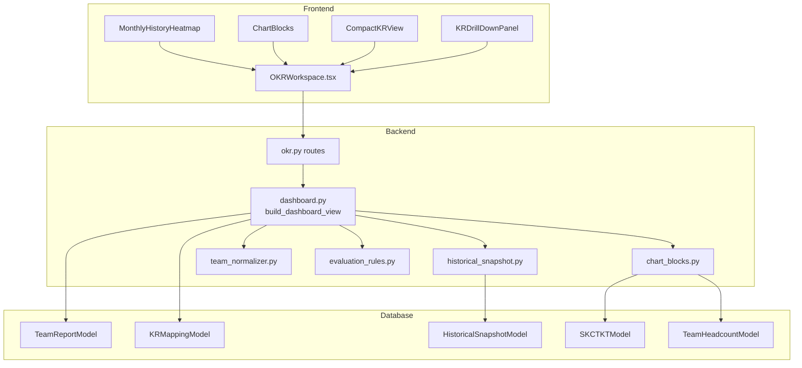
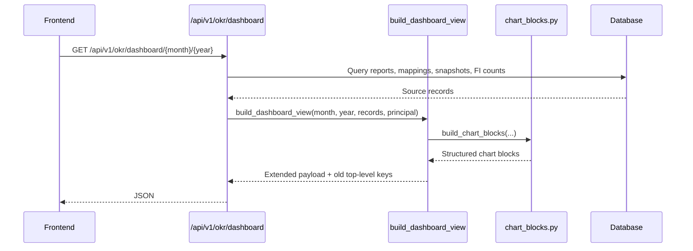

# Design Document: OKR Dashboard UI Enhancement

## Overview

This design implements the OKR Dashboard UI enhancement described in `requirements.md` and grounded by `docs/findings-okr-dashboard-ui-plan.md`.

The feature has five main outcomes:

1. Correct KR/data-sheet mappings in backend export and dashboard view.
2. Add a monthly history view equivalent to `Dashboard!A20:AC25`.
3. Add UI chart blocks for important metrics currently only visible in Excel.
4. Add a compact view for all master KR rows so less prominent KRs are not hidden.
5. Add KR/team drill-down while preserving existing dashboard API compatibility.

Important design constraint: UI dashboard data MUST NOT rely on rendering Excel. Excel export remains supported, but the UI gets a structured JSON dashboard view.

## Existing System Constraints

- Roles currently implemented in code are `Admin`, `Workshop_Leader`, `FI_Coordinator`, and `Team_Account`.
- Existing dashboard endpoint is `GET /api/v1/okr/dashboard/{month}/{year}`.
- Existing dashboard consumers expect top-level keys such as `columns`, `teams`, `leader_kpi_allocations`, and `kpi_allocation_summary`.
- Existing export function is `export_dashboard_workbook(...)`; it must keep producing `okr-dashboard-export.xlsx`.
- Existing normalized KR codes are stored as `O5.KR1`, not full master codes like `ĐCM.O4.ĐK.O5.KR1`.
- Some Excel team labels are inconsistent across ranges. The backend must normalize them to `TBHTĐK`, `TBCH`, `TBĐL`, `TCĐK` and preserve source labels for debugging.

## Architecture

### High-Level Architecture



### Dashboard Request Flow



## Backend Design

### Dashboard View Builder

Add `build_dashboard_view(...)` in `backend/app/services/okr/dashboard.py` and keep `build_dashboard_matrix(...)` for the existing matrix logic.

```python
def build_dashboard_view(
    month: int,
    year: int,
    team_reports: list[dict[str, Any]],
    master: list[Any],
    *,
    history_reports: list[dict[str, Any]] | None = None,
    historical_snapshots: list[dict[str, Any]] | None = None,
    principal: dict[str, str] | None = None,
) -> dict[str, Any]:
    """
    Build the structured UI dashboard.

    The response keeps old top-level matrix keys for backward compatibility and
    also includes the new grouped payload under period/matrix/monthly_history/etc.
    """
```

Response shape:

```python
matrix = build_dashboard_matrix(...)
return {
    **matrix,  # backward compatibility: columns, teams, leader_kpi_allocations, ...
    "period": {"month": month, "year": year},
    "matrix": matrix,
    "monthly_history": monthly_history,
    "chart_blocks": chart_blocks,
    "minor_okr_summary": minor_okr_summary,
    "source_references": source_references,
    "warnings": warnings,
}
```

### Role Filtering

The route remains available to all reference-view roles:

```python
require_role(Role.ADMIN, Role.WORKSHOP_LEADER, Role.FI_COORDINATOR, Role.TEAM_ACCOUNT)
```

Filtering rules:

| Role | Dashboard Data | Export | Import snapshot |
|---|---|---|---|
| `Admin` | all teams | yes | yes |
| `Workshop_Leader` | all teams | yes | no |
| `FI_Coordinator` | all teams read-only | no | no |
| `Team_Account` | own team only | no | no |

For `Team_Account`, the own team is derived from `principal["user_id"]` because existing demo/team accounts use team code IDs such as `TBHTĐK`. The backend must filter:

- `matrix.teams`
- `monthly_history`
- `minor_okr_summary.team_statuses`
- team-level chart blocks
- drill-down data

### KR/Data Block Mapping Corrections

Apply these corrections in `populate_data_sheet_from_reports(...)` and in the new UI chart builders:

| Block | Current/legacy issue | Correct mapping | Source reference |
|---|---|---|---|
| STOP by team | `O3.KR1` | `O3.KR2` | `data!A67:E70` |
| STOP by month | `O3.KR1` | `O3.KR2` | `data!A72:D84` |
| ET/KNL | `O5.KR15` | `O5.KR1` | `data!A135:B142` |
| Sáng kiến | previously combined with CTKT | `O5.KR12` | `data!A110:B114` |
| CTKT/FI | separate FI source | `O5.KR13` | FI module |
| VHDN/rèn luyện | combined VHDN | `O6.KR1` | `data!A86:E89` |
| Hội thao/chương trình chung | combined VHDN | `O6.KR2` | `data!A91:E94` |
| Đào tạo nội bộ | must remain T1-T11 | `O5.KR3` | `data!A98:N107` |

Training months are `T1-T11`; the design must not invent `T12` for this block.

### Unconfirmed Excel Blocks

These blocks are observed in Excel but not safely confirmed against a single master KR:

| Block | Range | Observed label | Candidate mapping |
|---|---|---|---|
| ĐK1.1 tổng hợp | `data!A3:E18` | `ĐK1.1` | `O2.KR2` or `O2.KR3` |
| Tổ trực ca điều khiển | `data!A21:E35` | `Tổ trực ca điều khiển` | O2-related, needs business confirmation |
| Weekly backlog | `data!A117:D127` | Tuần 14-22 backlog | likely `O2.KR3`, needs confirmation |

UI dashboard view MUST expose these under:

```json
"source_references": {
  "unconfirmed_blocks": [
    {
      "source_range": "data!A3:E18",
      "observed_label": "ĐK1.1",
      "candidate_kr_codes": ["O2.KR2", "O2.KR3"],
      "mapping_status": "needs_confirmation",
      "reason": "Target 0.98 conflicts with another confirmed BDĐK block."
    }
  ]
}
```

The UI view must not silently count these blocks into a KR without warning metadata. Excel export may preserve legacy output for compatibility, but that logic must remain separate from `build_dashboard_view(...)`.

### Team Name Normalization

Add a small helper module, for example `backend/app/services/okr/team_normalizer.py`.

```python
TEAM_LABEL_ALIASES = {
    "đội thiết bị hệ thống điều khiển": "TBHTĐK",
    "đội thiết bị htđk": "TBHTĐK",
    "đội thiết bị đo": "TBĐL",
    "đội thiết bị đo lường": "TBĐL",
    "đội thiết bị chấp hành": "TBCH",
    "đội thiết bị cơ cấu chấp hành": "TBCH",
    "tổ trực ca": "TCĐK",
    "tổ trực ca điều khiển": "TCĐK",
}

def normalize_team_label(value: str) -> tuple[str | None, str]:
    """Return (team_code, original_label)."""
```

Normalization should be case-insensitive and whitespace-normalized. Source labels should be retained in `source_references` for audit/debug.

### Evaluation Rules

Add `backend/app/services/okr/evaluation_rules.py` or keep this logic in `rules.py` if that file is the better local pattern.

Rules to preserve from Excel:

- `Dashboard!M15:P15` and `Dashboard!M16:P16` are separate merged blocks.
- `Hoàn thành tốt`: no discipline violation, no `NG` in O1-O5, and at least one GOOD bonus in `O6.KR1`, `O6.KR2`, or `O5.KR13`.
- `Hoàn thành`: no discipline violation and no `NG` in O1-O5, but no GOOD bonus.
- `Không HT`: discipline violation or any applicable O1-O5 KR is `NG`.

Expose rule references:

```json
"source_references": {
  "evaluation_rules": {
    "good": ["Dashboard!M15:P15", "Dashboard!M16:P16", "Dashboard!H17:P17", "Dashboard!L18:P18"],
    "completed": ["Dashboard!W15:Z15", "Dashboard!W16:Z16", "Dashboard!AD15:AF16"],
    "failed": ["Dashboard!AG15:AJ15", "Dashboard!AG16:AJ16", "Dashboard!AN15:AQ16"]
  }
}
```

### Chart Block Service

Create `backend/app/services/okr/chart_blocks.py`.

```python
from dataclasses import dataclass
from typing import Any, Literal

ChartBlockType = Literal[
    "stop_by_team",
    "stop_by_month",
    "training",
    "competency",
    "vhdn_running",
    "vhdn_sports",
    "sk_initiatives",
    "ctkt_fi",
]

@dataclass(frozen=True)
class ChartBlockConfig:
    block_type: ChartBlockType
    title: str
    chart_type: Literal["bar", "line", "radar", "cards", "progress_grid"]
    kr_code: str
    source_reference: str
    master_target: float | str | None = None
    participation_target: float | None = None
```

Recommended chart blocks:

| Block type | KR | Chart | Source | Notes |
|---|---|---|---|---|
| `stop_by_team` | `O3.KR2` | bar | `data!A67:E70` | cards + headcount |
| `stop_by_month` | `O3.KR2` | line | `data!A72:D84` | T1-T12 |
| `training` | `O5.KR3` | bar | `data!A98:N107` | T1-T11 plan vs actual |
| `competency` | `O5.KR1` | radar/progress | `data!A135:B142` | target 8 |
| `vhdn_running` | `O6.KR1` | cards | `data!A86:E89` | participation target 0.5, master target 2 |
| `vhdn_sports` | `O6.KR2` | cards | `data!A91:E94` | participation target 0.5, master target 1 |
| `sk_initiatives` | `O5.KR12` | cards/bar | `data!A110:B114` | optional, shows initiatives by team |
| `ctkt_fi` | `O5.KR13` | cards/bar | FI module | optional, shows approved CTKT by team |

Missing values should be represented as `None`/`null`. Only use `0` when the source confirms actual zero.

### Historical Snapshot Service

Create `backend/app/services/okr/historical_snapshot.py`.

Primary responsibilities:

- Parse `Dashboard!A20:AC25` into team monthly summaries.
- Parse `data` blocks into optional historical chart data.
- Store parsed data idempotently.
- Let real `TeamReportModel` data override snapshots for the same team/month/year.
- Preserve source file hash/range/label metadata.

Recommended model:

```python
class HistoricalSnapshotModel(Base):
    __tablename__ = "historical_snapshots"

    id: Mapped[str] = mapped_column(String, primary_key=True)
    source_file_name: Mapped[str] = mapped_column(String, nullable=False)
    source_file_hash: Mapped[str] = mapped_column(String, nullable=False, index=True)
    source_sheet: Mapped[str] = mapped_column(String, nullable=False)
    source_range: Mapped[str] = mapped_column(String, nullable=False)
    source_label: Mapped[str | None] = mapped_column(String)
    team: Mapped[str] = mapped_column(String, index=True)
    month: Mapped[int] = mapped_column(Integer, index=True)
    year: Mapped[int] = mapped_column(Integer, index=True)
    monthly_assessment: Mapped[str | None] = mapped_column(String)
    kr_statuses: Mapped[dict[str, str]] = mapped_column(JSON, default=dict)
    chart_payload: Mapped[dict[str, Any]] = mapped_column(JSON, default=dict)
    warnings: Mapped[list[dict[str, Any]]] = mapped_column(JSON, default=list)
    imported_by: Mapped[str] = mapped_column(String, nullable=False)
    imported_at: Mapped[datetime] = mapped_column(DateTime(timezone=True), server_default=func.now())
    is_historical_snapshot: Mapped[bool] = mapped_column(Boolean, default=True, nullable=False)

    __table_args__ = (
        UniqueConstraint(
            "source_file_hash",
            "team",
            "month",
            "year",
            "source_range",
            name="uq_historical_snapshot_source_period_team_range",
        ),
    )
```

If the implementation prefers reusing `TeamReportModel`, use `source_type = "excel_snapshot"` and equivalent metadata, but the dedicated model is cleaner because snapshot rows may represent partial chart data rather than full team reports.

## API Design

### Enhanced Dashboard Endpoint

```
GET /api/v1/okr/dashboard/{month}/{year}
```

Return old top-level keys plus new structured fields:

```json
{
  "columns": [],
  "teams": [],
  "leader_kpi_allocations": [],
  "kpi_allocation_summary": {},
  "period": { "month": 5, "year": 2026 },
  "matrix": {
    "columns": [],
    "teams": [],
    "leader_kpi_allocations": [],
    "kpi_allocation_summary": {}
  },
  "monthly_history": [
    {
      "team": "TBHTĐK",
      "team_name": "Đội thiết bị hệ thống điều khiển",
      "months": [
        { "month": 1, "year": 2026, "assessment": "HT", "source": "snapshot" },
        { "month": 2, "year": 2026, "assessment": null, "source": null }
      ]
    }
  ],
  "chart_blocks": {
    "stop_by_team": {
      "block_type": "stop_by_team",
      "title": "STOP theo đội/tổ",
      "chart_type": "bar",
      "kr_code": "O3.KR2",
      "labels": ["TBHTĐK", "TBCH", "TBĐL", "TCĐK"],
      "datasets": [
        { "label": "Số thẻ ghi nhận", "data": [9, 10, 13, 14] },
        { "label": "Tổng nhân sự", "data": [10, 14, 12, 14] }
      ],
      "master_target": 200,
      "source_reference": "data!A67:E70",
      "mapping_status": "confirmed",
      "warnings": []
    },
    "stop_by_month": {},
    "training": {},
    "competency": {},
    "vhdn_running": {},
    "vhdn_sports": {}
  },
  "minor_okr_summary": [
    {
      "workshop_kr_code": "O5.KR1",
      "kr_name": "Trụ cột ET: Xây dựng khung năng lực",
      "target_value": "8",
      "dashboard_column": "AD",
      "source_row": 28,
      "team_statuses": {
        "TBHTĐK": "OK",
        "TBCH": "OK",
        "TBĐL": "#N/A",
        "TCĐK": "OK"
      },
      "numeric_metric": null
    }
  ],
  "source_references": {
    "dashboard_history_range": "Dashboard!A20:AC25",
    "data_blocks": {
      "stop_by_team": "data!A67:E70",
      "stop_by_month": "data!A72:D84",
      "training": "data!A98:N107",
      "competency": "data!A135:B142",
      "vhdn_running": "data!A86:E89",
      "vhdn_sports": "data!A91:E94"
    },
    "evaluation_rules": {},
    "unconfirmed_blocks": []
  },
  "warnings": []
}
```

### Historical Snapshot Import Endpoint

```
POST /api/v1/okr/historical-snapshots/import
```

Access: `Admin` only.

Request: `multipart/form-data` with `.xlsx` workbook.

Response:

```json
{
  "imported_count": 16,
  "updated_count": 0,
  "skipped_duplicates": 0,
  "months_covered": [1, 2, 3, 4],
  "source_file_hash": "sha256...",
  "warnings": []
}
```

### Drill-Down Data

Phase 1 should derive drill-down data from the dashboard payload to avoid a second endpoint. A future endpoint can be added only if payload size becomes an issue:

```
GET /api/v1/okr/dashboard/{month}/{year}/kr/{kr_code}
```

## Backend Schemas

Create schema types only if the project wants typed responses. The current code frequently returns plain dictionaries; both are acceptable if tests enforce the shape.

```python
from typing import Any, Literal

from pydantic import BaseModel, Field

class ChartDataset(BaseModel):
    label: str
    data: list[float | int | None]
    backgroundColor: str | list[str] | None = None
    borderColor: str | None = None

class ChartBlockData(BaseModel):
    block_type: Literal[
        "stop_by_team",
        "stop_by_month",
        "training",
        "competency",
        "vhdn_running",
        "vhdn_sports",
        "sk_initiatives",
        "ctkt_fi",
    ]
    title: str
    chart_type: Literal["bar", "line", "radar", "cards", "progress_grid"]
    kr_code: str
    labels: list[str]
    datasets: list[ChartDataset]
    master_target: float | str | None = None
    participation_target: float | None = None
    source_reference: str
    mapping_status: Literal["confirmed", "needs_confirmation"] = "confirmed"
    warnings: list[dict[str, Any]] = Field(default_factory=list)

class ChartBlocksResponse(BaseModel):
    stop_by_team: ChartBlockData | None = None
    stop_by_month: ChartBlockData | None = None
    training: ChartBlockData | None = None
    competency: ChartBlockData | None = None
    vhdn_running: ChartBlockData | None = None
    vhdn_sports: ChartBlockData | None = None
    sk_initiatives: ChartBlockData | None = None
    ctkt_fi: ChartBlockData | None = None
```

```python
class MonthAssessment(BaseModel):
    month: int
    year: int
    assessment: Literal["HT tốt", "HT", "Không HT"] | None
    source: Literal["db", "snapshot"] | None = None

class MonthlyHistoryEntry(BaseModel):
    team: str
    team_name: str
    months: list[MonthAssessment]  # always 12 items

class KRSummaryEntry(BaseModel):
    workshop_kr_code: str
    kr_name: str
    target_value: str
    dashboard_column: str
    source_row: int | None = None
    team_statuses: dict[str, str]
    numeric_metric: dict[str, Any] | None = None
```

## Frontend Design

### Component Structure

```
frontend/src/features/okr/
  OKRWorkspace.tsx
  types/dashboard.ts
  components/
    MonthlyHistoryHeatmap.tsx
    ChartBlocks.tsx
    CompactKRView.tsx
    KRDrillDownPanel.tsx
```

`OKRWorkspace.tsx` remains the integration point. Suggested sections:

- Current matrix
- Monthly history
- Dashboard metrics
- All KR compact view
- Uploaded reports and warnings for manager roles

### Frontend Types

```typescript
export type ChartBlockType =
  | "stop_by_team"
  | "stop_by_month"
  | "training"
  | "competency"
  | "vhdn_running"
  | "vhdn_sports"
  | "sk_initiatives"
  | "ctkt_fi";

export interface ChartDataset {
  label: string;
  data: Array<number | null>;
  backgroundColor?: string | string[];
  borderColor?: string;
}

export interface ChartBlockData {
  block_type: ChartBlockType;
  title: string;
  chart_type: "bar" | "line" | "radar" | "cards" | "progress_grid";
  kr_code: string;
  labels: string[];
  datasets: ChartDataset[];
  master_target?: number | string | null;
  participation_target?: number | null;
  source_reference: string;
  mapping_status: "confirmed" | "needs_confirmation";
  warnings: Array<Record<string, unknown>>;
}
```

```typescript
export interface KRSummary {
  workshop_kr_code: string;
  kr_name: string;
  target_value: string;
  dashboard_column: string;
  source_row?: number | null;
  team_statuses: Record<string, "OK" | "GOOD" | "NG" | "#N/A">;
  numeric_metric?: {
    actual: number;
    target: number;
    percentage?: number | null;
  } | null;
}
```

### Chart Rendering

Use the existing frontend stack first. Recharts is allowed by requirements, but adding a dependency should only happen if CSS/SVG charts become too costly.

Default plan:

- Bar charts: CSS grid bars or inline SVG.
- Line chart: inline SVG polyline with null gaps skipped.
- Competency: progress grid first; radar chart can be a later enhancement.
- Participation cards: compact cards/rows with progress bars.

The UI must never show `0` for missing data. Null chart points should render as gaps or empty cells.

### Drill-Down

The drill-down panel is computed from:

- `matrix.teams[].kr_statuses`
- `minor_okr_summary`
- `chart_blocks`
- source/warning metadata

No separate API endpoint is needed in phase 1.

## Cache and Invalidation

Set dashboard cache TTL to a configurable value with default `300` seconds.

Because dashboard data can be role-filtered, the implementation must use one of these safe cache strategies:

- Cache the unfiltered dashboard internally and apply role filtering after reading from cache, or
- Include role/user/team scope in the cache key, for example `okr:dashboard:{month}:{year}:{role}:{user_id}`.

The implementation must not serve an all-team cached payload to a `Team_Account`.

Invalidate dashboard cache on:

- report upload
- web input submit
- web input lock/unlock
- historical snapshot import
- admin KR mapping update
- headcount update
- FI record transition/upload/delete that changes OKR counts

The current route uses `15 * 60`; implementation should reduce this to the configured default not exceeding 5 minutes.

## Error Handling

### Backend

1. Mapping errors:
   - Confirmed mapping errors should create warnings and continue where possible.
   - Unconfirmed blocks must be reported under `source_references.unconfirmed_blocks`.

2. Historical import:
   - Row/range parse failures should be collected as warnings.
   - Invalid workbook or missing required sheets should return 400.
   - Duplicate imports should be idempotent.

3. Chart generation:
   - Missing source data should return null/empty datasets and warning metadata.
   - Missing actual values should remain `null`, not `0`.

4. Permissions:
   - UI hides unauthorized actions.
   - Backend enforces the same permissions.

### Frontend

1. Loading:
   - Show loading state for dashboard fetch and import/export actions.

2. Missing data:
   - Show `-` or empty state consistently.
   - Do not silently convert null to zero.

3. Warnings:
   - Show a small warning indicator for unconfirmed mappings or partial imports.

## Correctness Properties

### Property 1: Competency Excess Data Preservation

For any competency source with more than 8 positions, the main chart displays the 8 target positions and the extra positions are exposed in drill-down or warning metadata. Extra data is not silently discarded.

Validates: Requirement 2.4

### Property 2: SK and CTKT Separation

For any report/source text, `O5.KR12` sáng kiến and `O5.KR13` CTKT are not collapsed into one metric. Missing one source does not fail the whole dashboard/export.

Validates: Requirements 3.1-3.6

### Property 3: Participation Rate Always Displayed

For any VHDN/Hội thao source including 0% participation, the system displays the ratio B/C and the participation target 0.5 for all visible teams.

Validates: Requirements 4.3, 4.5

### Property 4: Monthly History Completeness

For any dashboard request, each visible team has exactly 12 month entries for the requested year. Missing months are represented as `null` and never inferred as `HT`.

Validates: Requirements 5.1, 5.3

### Property 5: Missing Chart Data Handling

For any chart block, missing data remains `null` or is omitted as a point. A zero value appears only when the source actual is explicitly zero.

Validates: Requirement 6.4

### Property 6: KR Summary Complete Coverage

For any master KR definition with N KRs, `minor_okr_summary` contains N entries. Role filtering may narrow the team statuses inside each entry, but it must not remove KR entries. Each entry includes code, name, target, dashboard column, and team statuses.

Validates: Requirements 7.1, 7.2

### Property 7: Numeric Metric Conditional Display

For any KR, numeric values and target comparisons are displayed only when numeric metric data exists; otherwise only status badges are displayed.

Validates: Requirements 7.6, 8.3

### Property 8: Historical Snapshot Priority

For any team/month/year where both a snapshot and a real report exist, dashboard display uses the real report data.

Validates: Requirement 10.4

### Property 9: Evaluation Rule Fidelity

For any team monthly evaluation, the classification follows the Excel rule sources: no merged `M15:P16`, GOOD bonus only from `O6.KR1`, `O6.KR2`, or `O5.KR13`, and any applicable O1-O5 `NG` causes `Không HT`.

Validates: Requirement 13

### Property 10: Unconfirmed Blocks Are Not Silent

For `data!A3:E18`, `data!A21:E35`, and `data!A117:D127`, the UI dashboard does not count the values into O2 KRs without `mapping_status = "needs_confirmation"` warning metadata.

Validates: Requirement 15

## Testing Strategy

### Backend Unit Tests

- STOP block maps to `O3.KR2`.
- Competency block maps to `O5.KR1`.
- Sáng kiến maps to `O5.KR12`; CTKT/FI maps to `O5.KR13`.
- VHDN/rèn luyện maps to `O6.KR1`; Hội thao maps to `O6.KR2`.
- Training chart only includes T1-T11.
- Team label aliases normalize to correct team codes.
- Evaluation rules classify `Hoàn thành tốt`, `Hoàn thành`, `Không HT` correctly.
- Unconfirmed blocks are exposed with `mapping_status = "needs_confirmation"`.

### API Integration Tests

- `GET /api/v1/okr/dashboard/{month}/{year}` returns old top-level keys and new structured keys.
- `monthly_history` contains 12 months per visible team.
- `chart_blocks` contains `stop_by_team`, `stop_by_month`, `training`, `competency`, `vhdn_running`, `vhdn_sports`.
- Missing chart points are null/omitted, not converted to zero.
- Role filtering:
  - `Admin`: all data and all actions.
  - `Workshop_Leader`: all dashboard data and export.
  - `FI_Coordinator`: read-only dashboard, no export/import.
  - `Team_Account`: own team only.
- Cache TTL does not exceed 5 minutes and cache invalidates on relevant mutations.

### Historical Snapshot Tests

- Import parses `Dashboard!A20:AC25`.
- Import stores source file hash, source range, source label, and normalized team code.
- Re-importing the same workbook is idempotent.
- Real DB report overrides snapshot for the same team/month/year.
- Invalid workbook returns 400 with useful details.

### Excel Export Regression Tests

- Export still produces `okr-dashboard-export.xlsx`.
- Export preserves workbook sheets `Dashboard` and `data`.
- Export writes corrected mapping for STOP and ET/KNL.
- Export separates `O5.KR12` and `O5.KR13`.
- Formula references in the source workbook are preserved where the current exporter intentionally preserves formulas.

### Frontend Tests

- Monthly history renders 12 columns and visible team rows.
- Chart blocks render all six required block types.
- Null chart data renders as gaps/empty state, not zero.
- Compact KR view filters by objective and searches by code/name.
- Drill-down opens from matrix and compact KR rows.
- Unauthorized actions are hidden/disabled for each role.

### Manual Verification Checklist

- Compare STOP, training, competency, VHDN, Hội thao values against `OKR tháng 04-2026 - X.ĐK.xlsx`.
- Verify `Team_Account` cannot see other teams.
- Verify `FI_Coordinator` can view but cannot export/import.
- Verify Excel export still opens and contains the corrected data blocks.
- Verify unconfirmed O2-related blocks show warning metadata instead of being silently counted.
